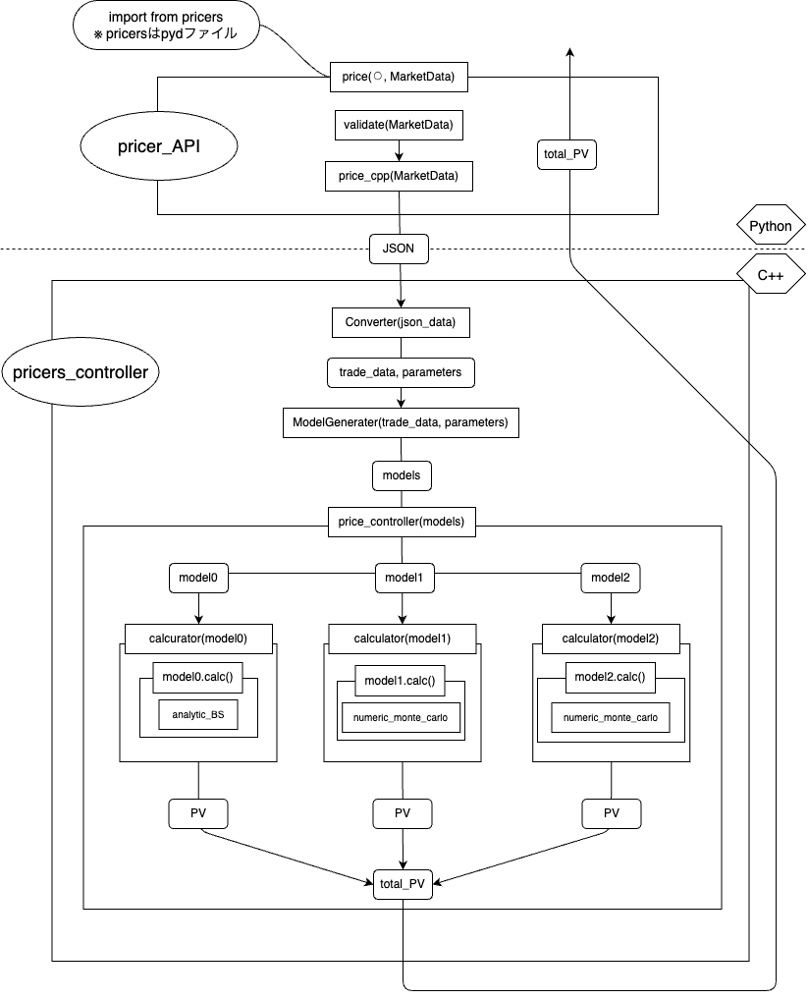

# API側の構成

このプロジェクトでは，PythonとC++を用いてプライサーのAPIを実装する．その具体的な構成は以下の図の通りである．
大きく分類すると，ユーザーからのリクエストを受け付け，適切にプライシングツールを呼び出す役割を持つ機能群を**pricer_API**，データを受け取って適切なプライシング処理を
制御する層を**pricers_controller**と呼ぶ．

## 処理の流れ
1. ブックデータとマーケットデータ（とある時点での断面）ともにブックのプライシングリクエストを"pricer_API"層(?)が受け取る．
2. "pricer_API"層の`price()`が，入力データ（ブックとマーケット）を確認，加工してC++のプライシングツールへと処理を委譲する．委譲は`price_cpp()`で行う．
    - プライシングツールには**JSON**形式でデータを渡す
3. データを受け取った"pricers_controller"層(?)がプライシングを行う．
    1. `converter()`がJSONデータをプライシング関数に渡すに適した形式のデータに変換する．図で言うところの`trade_data`と`parameters`．
        - 商品の種類ごとにデータをまとめるなどすることで，計算の効率化ができるかもしれない．
    2. `model_generator()`が，各商品を表すインスタンスを生成する．*European Call Option*や*Swap*など．図ではそれらのインスタンスを`model0, model1, model2`
    で表している．
    3. 商品モデルを用いて，`price_controller()`がプライシング計算を制御して合計価値を計算する．
        - 各商品モデルの`price()`メソッドを呼び出すなどする`calculator()`的な関数を使う？それとも`price_controller()`が直で`price()`メソッドを呼び出す？
4. `price()`は計算した合計価値を`price_cpp()`から受け取り，ユーザに返す．

## 各構成要素

構成図の主要な関数やクラスの役割や引数，返り値などを説明する．

### `price()`: function

UI（もしくはもう少し内側の関数等）からのプライス要請を受け，C++のプライスツールに適切なデータを引き渡し，最終的なプライス結果を受け取り，外に返すAPI．

- 役割: プライス計算の要請とC++層を適切に取り持つ．マーケットデータの整形（JSON形式への変換や，取引の種類ごとのデータの分類等）も行う可能性がある．
- 引数: ブックデータ，マーケットデータ．図における⚪︎がブックデータ（どのような形式で渡すか未定）である．
- 返り値: 引数として受け取ったマーケットデータにおけるブックの合計価値．

### `validate()`: function

上記の`price()`関数の中で主に使用されることが想定されている関数．

- 役割: マーケットデータに不整合や欠損値等が発生していないかどうかを確認する．ただし，プライサーへの入力として求められるロジカルな条件も満たしているかどうかは確認しない．
- 引数: `market_data`: マーケットデータ（おそらくDBからフェッチした際の表形式のまま渡される）
- 返り値: `boolean`: マーケットデータに異常がなければ`True`，そうでなければ`False`．

### `price_cpp()`: function

C++のコアプライサーをPythonから呼び出せるようにしただけのもの．Pybind11を使用して作成されている．

- 役割: C++のプライサーを呼び出す．
- 引数: `book_data`: ブックの内容のデータ．`market_data`: マーケットデータ．
- 返り値: 引数として受け取ったマーケットデータにおけるブックの合計価値．

### `